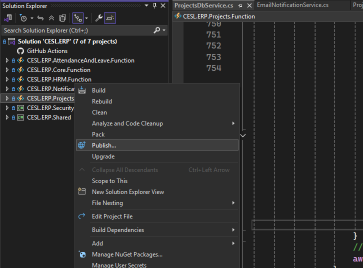
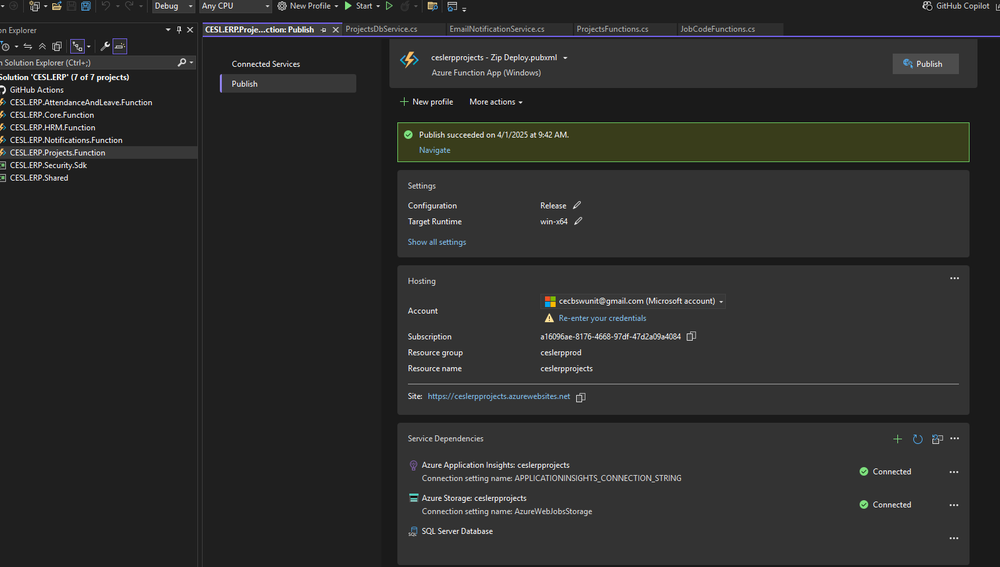

# CESL ERP Repository Handling

## Repositories

- [cesl.erp.projects.ui](https://github.com/ceslerp/cesl.erp.projects.ui)
    - CESL ERP UI project

- [CESL.ERP](https://github.com/ceslerp/CESL.ERP)
    - CESL ERP Modules

- [Documents](https://github.com/ceslerp/Documents)
    - CESL ERP Documentation

## Branching

Every repository contains three main branches

- dev
- main
- releaase

## New feature development

 1. When a new feature is started, developer should create a new branch from `dev` branch with feature name and start work. `Ex: feature/addSupplier`

 2. Once the developer is finished with feature development, developer should create a pull request to `dev` branch and should add team memebrs as reviewers. Before creating the pull request make sure to merge dev branch into your feature branch and test well.

 3. If any reviewer is given some comment to fix some code, developer should fix those issues and commit again

 4. If developer receive an approval from any reviewer, developer can merge code to the `dev` branch

 ## Release process

 ### cesl.erp.projects.ui release

 > **_IMPORTANT:_**  To release the ui we need to make the system offline. So make sure you have informed users before and allocated the time for release.

 - In cesl.erp.projects.ui repository create a pull request to `release` branch from `dev` branch and complete it.
 
 - Log into the cesl virtual machine in Azure

 - Take a backup of folder c:\Projects\cesl.erp.projects.ui

 - Stop IIS and running instance of cesl.erp.projects.ui (Use `Ctrl+c` in running cmd instance and close it to stop cesl.erp.projects.ui)

 - Open a command prompt and run the following commands

 ```bash

 # go to ui deployment folder
 cd c:\Projects\cesl.erp.projects.ui

# reset repository
git reset --hard

# take latest changes
git pull

# build the release
npm run build

# start the instance
npm run start

```

- Start the IIS

- Go to the git repository in browser and create a tag for current release branch. So we can refer this release later. `Ex tag: v2025.11.4`

### CESL ERP Function Application Release

- In CESL.ERP repository create a pull request to `release` branch from `dev` branch and complete it.

- Open solution in visual studio and checkout `release` branch

- Right click on function application you want to release and click `publish`

    - 

- Click `Publish` in new screen
    - 

- Go to the git repository in browser and create a tag for current release branch. So we can refer this release later. `Ex tag: v2025.11.4`
