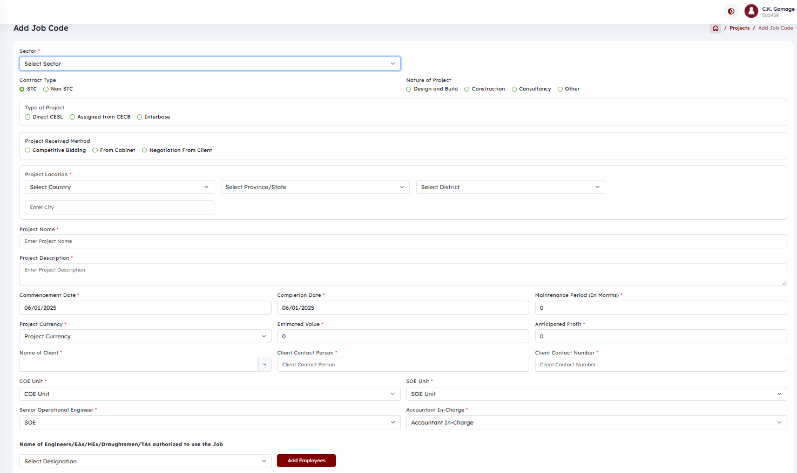

# CESL ERP Projects Module

This module handles the creation and manipulation of Projects and Suppliers. Creation of Project in the ERP is the first step of the project. CESL has a well defined project structure. Following digram depicts the projects structure of the CESL. There are 3 roles mainly involved in a project

- CEO - Chief Executive Officer
- COE - Chief Operational Engineer
- SOE - Senior Operational Engineer

A project is assigned to a relavent SOE and COE at the creation. After the creation, project will be handed over to the approval of COE. Once the COE approval is received, it will be handed over to the approval of CEO. If the CEO approved the project, project get active in the system and project will be given a unique id which is called  as Job Code. If COE or CEO reject the project, project will be rejected and will not process further.

In CESL there are 2 types of projects

1. Job Code
2. Business Segments

Following is the projects page of the system.

## Job Code

User can create a Job Code project by clcking the `Add Job Code` button in projects page. When a  Job Code project is initialized, following fields are requested.

## Business Segments

Business segments is another type of project in CESL. User can create a Business Segment project by clicking the `Add Business Segment` button in the projects screen.

## Projects Flow

Once the project is created, it will be forwarded to the approval of the respective COE. When the COE is logged in to the system, COE can approve/reject the project by  viewing the project in the Projects page.

If COE is approved the project, it will be forwarded to the approval of the CEO. CEO can login to the system and approve/reject the project by viewing the project in projects page.

If COE or CEO rejected the project, it will be in the rejected state and will not process further. On the approval of the CEO, system will generate a `Job Code Id` to the project. The relevant notifications will triggered by the system as emails based on the actions of the user.

**Notifications**
-----------------

| Action    | EMail |
|--------   | ---------|
| On project Creation | Email to COE for approval |
| COE Approved | Email to CEO for Approval |
| COE Rejected | Email to CEO / Project Creator on status |
| CEO Approved | Email to COE / Project Creator on status |
| CEO Rejected | Email to COE / Project Creator on status |

## Extend Job Code

In a Job Code project, after the approval of the project, SOE or a User who has assigned "JobRequest" role can change the some properties of the Job Code project. This feature is called as "Extend Project" and following are the fields that can be edited by this user.

## Suppliers

Suppliers section is used to add the suppliers to the system. Following fields are needed to add a supplier to the system.

__**Need to complete supplier part**__

## User Permissions

| Operation | Task Id | Action Id | Role |
|---------|-----------|-----------|------|
| Create a Job Code Project | Job Code | CREATE | |
| Extend a Job Code Project |Job Code | CREATE | `Job Request` or `SOE`| 
| Update a Job Code Project | Job Code | UPDATE | |
| View a Job Code Project | Job Code | VIEW| |
| Approve / Reject  a Job Code Project | | |`COE` or `CEO` |
| Create a Business Segment Project | Job Code | CREATE | |
| Update a Business Segment Project | Job Code | UPDATE | |
| View a Business Segment Project | Job Code | VIEW| |
| Approve / Reject  a Business Segment Project | | |`COE` or `CEO` |

## Database Structure

- Job Code projects data will be saved in the following tables

    

- Business Segments data will be saved in the following tables

    

- Attachments data will be saved in the following table and attachments will be saved in Azure storage accounts.

    